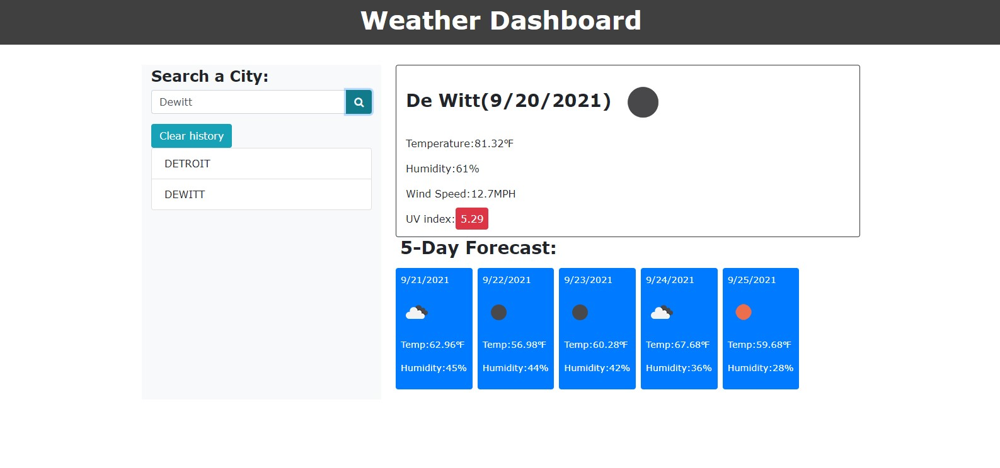

# Weather-Dashboard

## Description
This is a weather forecast dashboard app. Users are able to enter a city name in the search box and have current weather conditions displayed for that city, as well a five day forecast. The UV index value will change color from green, yellow and red based on the severity of the UV index. Searched cities will be added below the search button and can be clicked on to display that cities weather data again.

## Screenshot

## Tech Used
- OpenWeather API
- Javascript
- HTML
- CSS
- Bootstrap
- Moment.js
- Google Fonts
- Font Awesome
- Links